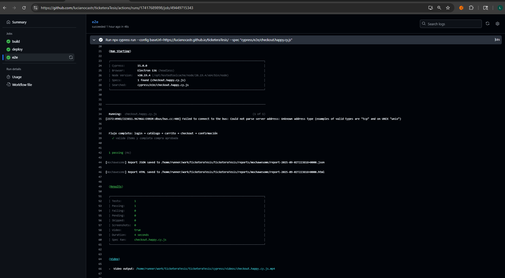
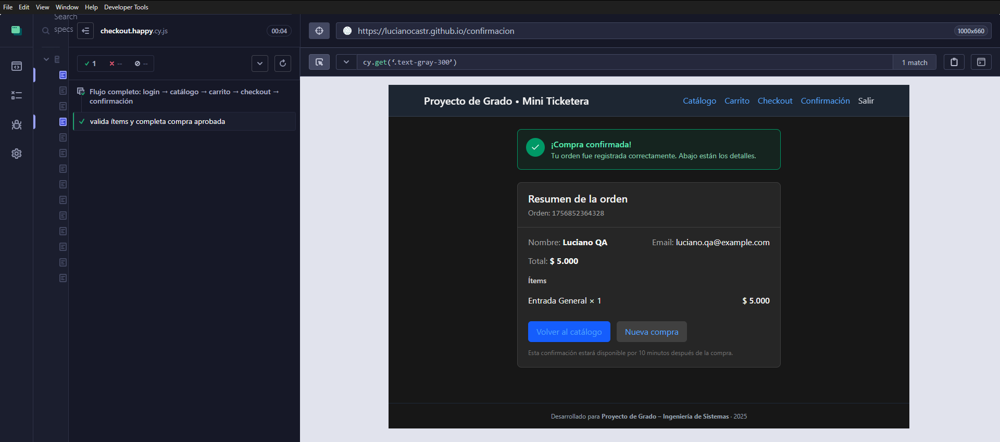

<style>
.slidev-layout {
  background: #0d1117 !important;
  color: #e6edf3;
}
.slidev-layout h1 { color: #10b981 !important; font-size: 1.6em !important; }
.slidev-layout h2 { color: #10b981 !important; }
.slidev-layout h3 { color: #58a6ff !important; }
.slidev-layout p  { margin: 0.4em 0; }
.slidev-layout ul { padding-left: 1.2em; }
.slidev-layout li { margin: 0.25em 0; }

.accent  { color: #10b981; font-weight: 700; }
.blue    { color: #58a6ff; font-weight: 600; }
.muted   { color: #8b949e; }
.red     { color: #f85149; font-weight: 600; }
.small   { font-size: 0.82em; }

.card {
  background: #161b22;
  border: 1px solid #30363d;
  border-radius: 8px;
  padding: 12px 16px;
}
.card-green {
  background: #071912;
  border: 1px solid #10b981;
  border-radius: 8px;
  padding: 12px 16px;
}
.card-blue {
  background: #071020;
  border: 1px solid #58a6ff;
  border-radius: 8px;
  padding: 12px 16px;
}
.card-red {
  background: #1c0a09;
  border: 1px solid #f85149;
  border-radius: 8px;
  padding: 12px 16px;
}

.metric-val   { font-size: 2.2em; font-weight: 800; color: #10b981; line-height: 1.1; }
.metric-label { font-size: 0.75em; color: #8b949e; margin-top: 3px; }

.badge       { display:inline-block; background:#10b981; color:#0d1117; font-size:0.68em; font-weight:700; padding:2px 7px; border-radius:20px; letter-spacing:.4px; }
.badge-blue  { display:inline-block; background:#58a6ff; color:#0d1117; font-size:0.68em; font-weight:700; padding:2px 7px; border-radius:20px; }
.badge-red   { display:inline-block; background:#f85149; color:#fff;    font-size:0.68em; font-weight:700; padding:2px 7px; border-radius:20px; }
.badge-gray  { display:inline-block; background:#30363d; color:#e6edf3; font-size:0.68em; font-weight:600; padding:2px 7px; border-radius:20px; }

table { width:100%; border-collapse:collapse; font-size:0.83em; }
th { background:#161b22; color:#10b981; padding:7px 11px; border:1px solid #30363d; text-align:left; }
td { padding:7px 11px; border:1px solid #21262d; color:#e6edf3; }
tr:nth-child(even) td { background:#0d1117; }

.demo-step {
  background:#161b22;
  border-left:3px solid #10b981;
  padding:8px 14px;
  margin:5px 0;
  border-radius:0 6px 6px 0;
  font-size:0.85em;
}
.step-n { color:#10b981; font-weight:700; margin-right:6px; }

.url-box {
  background:#161b22;
  border:1px solid #30363d;
  border-radius:6px;
  padding:6px 14px;
  font-family:'Fira Code', monospace;
  font-size:0.78em;
  color:#58a6ff;
}

.a-nd {
  display:flex; flex-direction:column; align-items:center; justify-content:center;
  background:#161b22; border:1px solid #30363d; border-radius:8px;
  padding:7px 12px; text-align:center; flex-shrink:0; min-width:88px;
  transition: all 0.32s ease;
}
.a-ic { font-size:1.35em; margin-bottom:2px; }
.a-lb { color:#e6edf3; font-weight:700; font-size:0.70em; line-height:1.2; }
.a-sb { color:#8b949e; font-size:0.62em; line-height:1.3; margin-top:1px; }
.a-nd.a-on { border-color:#10b981 !important; background:#071912 !important; box-shadow:0 0 18px #10b98155; transform:scale(1.10); z-index:5; }
.a-nd.a-off { opacity:0.12; transform:scale(0.95); }
.a-ar { color:#30363d; font-size:1.05em; flex-shrink:0; transition:color 0.32s; line-height:1; }
.a-ar.a-on { color:#10b981; }
.a-ar.a-off { opacity:0.08; }
.a-zn { border-radius:10px; padding:10px 14px; border:1px solid; }
.a-zc { background:#07120eaa; border-color:#10b98120; }
.a-zl { background:#07090f; border-color:#58a6ff20; }
.a-zn-lb { font-size:0.60em; font-weight:700; letter-spacing:2px; margin-bottom:8px; }
.a-row { display:flex; align-items:center; gap:7px; }
.a-cap { text-align:center; font-size:0.75em; font-weight:600; min-height:20px; margin-top:6px; }
</style>

---
layout: cover
background: linear-gradient(160deg, #0d1117 0%, #071912 60%, #0d1117 100%)
---

<div class="text-center">

<div class="mb-3">
  
</div>

<div class="muted small" style="letter-spacing:2px; margin-bottom:10px;">TRABAJO DE GRADO · INGENIERÍA EN SISTEMAS</div>

<h1 style="font-size:1.55em !important; line-height:1.35; color:#fff !important; font-weight:800; margin-bottom:6px;">
  Estrategia de Automatización de<br>
  <span style="color:#10b981;">Pruebas Funcionales y de Regresión</span>
</h1>
<p class="muted" style="font-size:0.9em; margin-bottom:26px;">para la mejora de la calidad del software en entornos cloud</p>

<div style="display:grid; grid-template-columns:1fr 1fr; gap:14px; max-width:480px; margin:0 auto;">
  <div class="card">
    <div class="muted small" style="letter-spacing:1px; margin-bottom:5px;">ESTUDIANTES</div>
    <div style="font-weight:600;">Luciano Castro</div>
    <div style="font-weight:600;">Matías Primitz</div>
  </div>
  <div class="card">
    <div class="muted small" style="letter-spacing:1px; margin-bottom:5px;">TUTORA</div>
    <div style="font-weight:600;">Lic. Natalia Mira</div>
    <div class="muted small" style="margin-top:5px;">Ingeniería en Sistemas · 2025</div>
  </div>
</div>

</div>

---

# Agenda

<div style="display:grid; grid-template-columns:1fr 1fr; gap:12px; margin-top:20px;">

<div v-click class="card-green" style="display:flex; gap:12px; align-items:flex-start;">
  <div style="font-size:1.5em; flex-shrink:0;">🔍</div>
  <div>
    <div class="accent small" style="font-weight:700; letter-spacing:.5px;">01 · PROBLEMÁTICA</div>
    <div class="muted small">Contexto, evidencia e impacto del testing manual en sistemas transaccionales</div>
  </div>
</div>

<div v-click class="card-green" style="display:flex; gap:12px; align-items:flex-start;">
  <div style="font-size:1.5em; flex-shrink:0;">🎯</div>
  <div>
    <div class="accent small" style="font-weight:700; letter-spacing:.5px;">02 · PROPUESTA</div>
    <div class="muted small">Sistema bajo prueba, objetivos, hipótesis y arquitectura de la solución</div>
  </div>
</div>

<div v-click class="card-green" style="display:flex; gap:12px; align-items:flex-start;">
  <div style="font-size:1.5em; flex-shrink:0;">⚡</div>
  <div>
    <div class="accent small" style="font-weight:700; letter-spacing:.5px;">03 · DEMO EN VIVO</div>
    <div class="muted small">Pipeline CI/CD y Cypress ejecutando en tiempo real ante el tribunal</div>
  </div>
</div>

<div v-click class="card-green" style="display:flex; gap:12px; align-items:flex-start;">
  <div style="font-size:1.5em; flex-shrink:0;">📊</div>
  <div>
    <div class="accent small" style="font-weight:700; letter-spacing:.5px;">04 · RESULTADOS</div>
    <div class="muted small">Métricas comparativas manual vs. automatizado — validación ISO/IEC 25010</div>
  </div>
</div>

<div v-click class="card-green" style="grid-column:span 2; display:flex; gap:12px; align-items:center; justify-content:center;">
  <div style="font-size:1.5em;">✅</div>
  <div class="accent small" style="font-weight:700; letter-spacing:.5px;">05 · CONCLUSIONES Y PREGUNTAS</div>
</div>

</div>

---

# 01 · La Problemática

<div style="display:grid; grid-template-columns:1fr 1fr; gap:14px; margin-top:16px;">

<div>

<div v-click class="card-red" style="margin-bottom:10px;">
  <div style="display:flex; justify-content:space-between; align-items:center; margin-bottom:6px;">
    <span class="red" style="font-size:0.82em; font-weight:700;">World Quality Report 2023-24</span>
    <span class="badge-red">industria</span>
  </div>
  <p class="small">El <span class="accent">60% de las organizaciones</span> reporta que la falta de automatización es su principal obstáculo para entrega continua.</p>
</div>

<div v-click class="card-red" style="margin-bottom:10px;">
  <div style="display:flex; justify-content:space-between; align-items:center; margin-bottom:6px;">
    <span class="red" style="font-size:0.82em; font-weight:700;">PractiTest · State of Testing 2023</span>
    <span class="badge-red">costo</span>
  </div>
  <p class="small">Un defecto en producción cuesta <span class="accent">6× más</span> que uno detectado durante el desarrollo.</p>
</div>

<div v-click class="card-red">
  <div style="display:flex; justify-content:space-between; align-items:center; margin-bottom:6px;">
    <span class="red" style="font-size:0.82em; font-weight:700;">ISTQB 2023</span>
    <span class="badge-red">adopción</span>
  </div>
  <p class="small">Solo el <span class="accent">26% de equipos</span> tiene automatización integrada en su pipeline de CI/CD.</p>
</div>

</div>

<div v-click style="display:flex; flex-direction:column; gap:10px; justify-content:center;">
  <div class="card" style="text-align:center;">
    <div class="metric-val">43%</div>
    <div class="metric-label">cobertura promedio<br>con testing manual</div>
    <div style="font-size:0.58em; color:#58a6ff; margin-top:4px;">medición propia — baseline</div>
  </div>
  <div class="card" style="text-align:center;">
    <div class="metric-val">20%</div>
    <div class="metric-label">defectos detectados<br>antes de producción</div>
    <div style="font-size:0.58em; color:#58a6ff; margin-top:4px;">medición propia — baseline</div>
  </div>
  <div class="card" style="text-align:center;">
    <div class="metric-val">&lt;50%</div>
    <div class="metric-label">reproducibilidad<br>de ejecuciones manuales</div>
    <div style="font-size:0.58em; color:#58a6ff; margin-top:4px;">medición propia — baseline</div>
  </div>
</div>

</div>

---

# 02 · El Sistema Bajo Prueba

<div class="muted small" style="margin-bottom:14px;">
  <span class="badge-gray">Mini Ticketera</span>&nbsp;
  Plataforma web de venta de entradas desarrollada en React + Vite — desplegada en GitHub Pages
</div>

<div style="display:grid; grid-template-columns:1fr 1fr 1fr 1fr; gap:8px;">

<div v-click style="text-align:center;">
  <div class="muted small" style="margin-bottom:4px; letter-spacing:.5px;">LOGIN</div>
  
  <div class="muted" style="font-size:0.65em; margin-top:4px;">TC-001 · Autenticación</div>
</div>

<div v-click style="text-align:center;">
  <div class="muted small" style="margin-bottom:4px; letter-spacing:.5px;">CATÁLOGO</div>
  
  <div class="muted" style="font-size:0.65em; margin-top:4px;">TC-005 · Disponibilidad</div>
</div>

<div v-click style="text-align:center;">
  <div class="muted small" style="margin-bottom:4px; letter-spacing:.5px;">CHECKOUT</div>
  
  <div class="muted" style="font-size:0.65em; margin-top:4px;">TC-002/003 · Compra & Pago</div>
</div>

<div v-click style="text-align:center;">
  <div class="muted small" style="margin-bottom:4px; letter-spacing:.5px;">CONFIRMACIÓN</div>
  
  <div class="muted" style="font-size:0.65em; margin-top:4px;">TC-002 · Happy path</div>
</div>

</div>

<div v-click style="margin-top:14px; display:flex; gap:10px; align-items:center;">
  <div class="url-box" style="flex:1;">🌐&nbsp; https://lucianocastr.github.io/ticketeraTesis/</div>
  <div class="url-box" style="flex:1;">📦&nbsp; github.com/lucianocastr/ticketeraTesis</div>
</div>

---
layout: center
background: linear-gradient(160deg, #0d1117 0%, #071912 100%)
---

<div style="text-align:center; max-width:720px; margin:0 auto;">

<div class="muted small" style="letter-spacing:2px; margin-bottom:16px;">02 · HIPÓTESIS DE TRABAJO</div>

<p style="font-size:1.25em; line-height:1.7; color:#e6edf3;">
  La integración sistemática de pruebas funcionales y de regresión automatizadas
  dentro de un pipeline CI/CD en entornos cloud
  <span class="accent">mejora de forma medible, reproducible y sostenible</span>
  la calidad del software transaccional.
</p>

<div style="display:grid; grid-template-columns:repeat(3,1fr); gap:14px; margin-top:28px;">
  <div v-click class="card-green" style="text-align:center;">
    <div style="font-size:1.6em;">📏</div>
    <div class="accent small" style="font-weight:700; margin-top:4px;">Medible</div>
    <div class="muted small">métricas de tiempo,<br>cobertura y defectos</div>
  </div>
  <div v-click class="card-green" style="text-align:center;">
    <div style="font-size:1.6em;">🔁</div>
    <div class="accent small" style="font-weight:700; margin-top:4px;">Reproducible</div>
    <div class="muted small">mismos resultados en<br>cada ejecución</div>
  </div>
  <div v-click class="card-green" style="text-align:center;">
    <div style="font-size:1.6em;">♻️</div>
    <div class="accent small" style="font-weight:700; margin-top:4px;">Sostenible</div>
    <div class="muted small">versionado junto al código,<br>sin esfuerzo adicional</div>
  </div>
</div>

</div>

---

# 02 · Objetivo General

<div v-click class="card-blue" style="margin: 12px 0; padding:16px 20px;">
  <p style="font-size:0.92em; line-height:1.6; margin:0;">
    Diseñar, aplicar y validar una estrategia integral de pruebas funcionales y de regresión automatizadas,
    ejecutadas en entornos cloud, que integre las fases de
    <span class="blue">construcción, despliegue, ejecución, reporting y gestión de calidad</span>
    dentro de un flujo continuo, conforme a <span class="blue">ISO/IEC 25010:2023</span>.
  </p>
</div>

<div style="display:grid; grid-template-columns:repeat(3,1fr); gap:9px; margin-top:14px;">

<div v-click class="card small">
  <span class="accent" style="font-weight:700;">OE1</span> &nbsp;Documentar impacto técnico y operativo de la ausencia de automatización
</div>
<div v-click class="card small">
  <span class="accent" style="font-weight:700;">OE2</span> &nbsp;Identificar atributos de calidad afectados según ISO/IEC 25010:2023
</div>
<div v-click class="card small">
  <span class="accent" style="font-weight:700;">OE3</span> &nbsp;Diseñar estrategia de pruebas por cobertura, criticidad y riesgo
</div>
<div v-click class="card small">
  <span class="accent" style="font-weight:700;">OE4</span> &nbsp;Implementar solución funcional con Cypress + GitHub Actions
</div>
<div v-click class="card small">
  <span class="accent" style="font-weight:700;">OE5</span> &nbsp;Validar efectividad mediante métricas y simulaciones de regresión
</div>
<div v-click class="card small">
  <span class="accent" style="font-weight:700;">OE6</span> &nbsp;Documentar estrategia replicable a otros entornos equivalentes
</div>

</div>

---

# 02 · Alcance y Limitaciones

<div style="display:grid; grid-template-columns:1fr 1fr; gap:12px; margin-top:16px;">

<div>
<div class="card-blue small" style="margin-bottom:10px;">
  <div class="blue" style="font-weight:700; margin-bottom:6px;">✔ Dentro del alcance</div>
  <ul style="margin:0; padding-left:1.1em;">
    <li>Pruebas funcionales E2E sobre flujos transaccionales críticos</li>
    <li>Pipeline CI/CD completo en entorno cloud (GitHub)</li>
    <li>Comparación cuantitativa manual vs. automatizado</li>
    <li>Alineación con ISO/IEC 25010:2023</li>
    <li>Estrategia documentada y replicable</li>
  </ul>
</div>
</div>

<div>
<div class="card-red small" style="margin-bottom:10px;">
  <div class="red" style="font-weight:700; margin-bottom:6px;">✗ Fuera del alcance</div>
  <ul style="margin:0; padding-left:1.1em;">
    <li>Pruebas unitarias y de integración</li>
    <li>Pruebas de performance y carga</li>
    <li>Sistema legacy o de terceros</li>
    <li>Validación con muestra estadísticamente significativa</li>
    <li>Ambiente cloud empresarial (AWS / Azure / GCP)</li>
  </ul>
</div>
</div>

</div>

<div v-click class="card" style="margin-top:10px; border-left:3px solid #58a6ff; border-radius:0 8px 8px 0;">
  <p class="small" style="margin:0;">El sistema bajo prueba fue desarrollado por los autores con testeabilidad como requisito de diseño. Los resultados son válidos como <span class="blue">prueba de concepto</span> y base para la replicación en entornos reales.</p>
</div>

---
clicks: 6
---

# 02 · Arquitectura de la Solución

<div style="margin-top:10px;"><div class="a-zn a-zc" style="margin-bottom:7px;"><div class="a-zn-lb" style="color:#10b981;">☁️ CLOUD</div><div class="a-row" style="margin-bottom:9px;"><div class="a-nd" :class="$clicks===2?'a-on':$clicks>0?'a-off':''"><div class="a-ic">🐙</div><div class="a-lb">GitHub</div><div class="a-sb">Repositorio</div></div><div class="a-ar" :class="($clicks===2||$clicks===3)?'a-on':$clicks>0?'a-off':''">→</div><div class="a-nd" :class="$clicks===3?'a-on':$clicks>0?'a-off':''"><div class="a-ic">⚙️</div><div class="a-lb">GitHub Actions</div><div class="a-sb">Pipeline YAML</div></div><div class="a-ar" :class="($clicks===3||$clicks===4)?'a-on':$clicks>0?'a-off':''">→</div><div class="a-nd" :class="$clicks===4?'a-on':$clicks>0?'a-off':''"><div class="a-ic">⚛️</div><div class="a-lb">Build + Deploy</div><div class="a-sb">React + Vite · GitHub Pages</div></div><div style="flex:1;"></div></div><div class="a-row" style="padding-left:116px;"><div class="a-ar" style="transform:rotate(90deg);" :class="($clicks===3||$clicks===5)?'a-on':$clicks>0?'a-off':''">→</div><div class="a-nd" :class="$clicks===5?'a-on':$clicks>0?'a-off':''"><div class="a-ic">🌲</div><div class="a-lb">Cypress E2E</div><div class="a-sb">6 specs · headless</div></div><div class="a-ar" :class="$clicks===6?'a-on':$clicks>0?'a-off':''">→</div><div class="a-nd" :class="$clicks===6?'a-on':$clicks>0?'a-off':''"><div class="a-ic">📊</div><div class="a-lb">Cypress Cloud</div><div class="a-sb">resultados + evidencias</div></div><div class="a-ar" :class="$clicks===6?'a-on':$clicks>0?'a-off':''">→</div><div class="a-nd" :class="$clicks===6?'a-on':$clicks>0?'a-off':''"><div class="a-ic">📋</div><div class="a-lb">GitHub Projects</div><div class="a-sb">issues auto-gestionados</div></div></div></div><div class="a-zn a-zl"><div class="a-zn-lb" style="color:#58a6ff;">🖥️ LOCAL</div><div class="a-row"><div class="a-nd" :class="$clicks===1?'a-on':$clicks>0?'a-off':''"><div class="a-ic">👨‍💻</div><div class="a-lb">Equipo Dev</div><div class="a-sb">commit / push</div></div><div class="a-ar" :class="$clicks===1?'a-on':$clicks>0?'a-off':''">+</div><div class="a-nd" :class="$clicks===1?'a-on':$clicks>0?'a-off':''"><div class="a-ic">🧪</div><div class="a-lb">Equipo QA</div><div class="a-sb">specs · commit / push</div></div><div class="a-ar" :class="($clicks===1||$clicks===2)?'a-on':$clicks>0?'a-off':''">⬆ push</div><div style="flex:1;"></div><div class="a-nd" :class="$clicks===6?'a-on':$clicks>0?'a-off':''"><div class="a-ic">👔</div><div class="a-lb">Product Owner</div><div class="a-sb">Approve / Reject</div></div></div></div><div class="a-cap"><span v-if="$clicks===0" style="color:#8b949e;font-weight:400;">→ para recorrer el flujo etapa por etapa</span><span v-if="$clicks===1" style="color:#10b981;">① Dev escribe código · QA escribe specs de Cypress · ambos hacen commit y push</span><span v-if="$clicks===2" style="color:#10b981;">② GitHub recibe el push y dispara automáticamente el trigger CI/CD</span><span v-if="$clicks===3" style="color:#10b981;">③ GitHub Actions lee el YAML y orquesta todos los pasos del pipeline</span><span v-if="$clicks===4" style="color:#10b981;">④ Build de la app React + Vite y deploy automático en GitHub Pages</span><span v-if="$clicks===5" style="color:#10b981;">⑤ Cypress ejecuta los 6 specs en modo headless contra la app desplegada</span><span v-if="$clicks===6" style="color:#10b981;">⑥ Cypress Cloud registra resultados · GitHub Projects gestiona los issues automáticamente</span></div></div>

---

# 02 · Pipeline CI/CD

<div style="display:grid; grid-template-columns:1.1fr 1fr; gap:14px; margin-top:8px; align-items:start;">

```yaml {1-5|7-15|17-28|all}
name: CI/CD — Deploy & E2E Tests

on:
  push:       { branches: [main] }
  workflow_dispatch:   # disparo manual

jobs:
  build-and-deploy:
    runs-on: ubuntu-latest
    steps:
      - uses: actions/checkout@v4
      - uses: actions/setup-node@v4
        with: { node-version: 18 }
      - run: npm ci && npm run build
      - uses: peaceiris/actions-gh-pages@v3

  cypress-e2e:
    needs: build-and-deploy
    runs-on: ubuntu-latest
    steps:
      - uses: actions/checkout@v4
      - uses: cypress-io/github-action@v6
        with:
          browser: chrome
          record: true
        env:
          CYPRESS_RECORD_KEY: ${{ secrets.CYPRESS_RECORD_KEY }}
      - uses: actions/upload-artifact@v4
        with: { name: mochawesome-report, path: cypress/reports/ }
```

<div>
  
  <div v-click class="card-green small" style="text-align:center;">
    Job <span class="accent">e2e: succeeded</span> · 3 pasos: build → deploy → test
  </div>
</div>

</div>

---

# 02 · Los 6 Casos de Prueba

<div style="display:grid; grid-template-columns:1fr 1.1fr; gap:16px; margin-top:12px; align-items:start;">

<div>
  
  <div class="muted" style="font-size:0.7em; text-align:center; margin-top:5px;">
    Cypress Cloud — todos los specs en una ejecución real
  </div>
</div>

<div>
  <table>
    <thead><tr><th>ID</th><th>Flujo crítico</th></tr></thead>
    <tbody>
      <tr><td><span class="badge">TC-001</span></td><td>Login correcto e inválido</td></tr>
      <tr><td><span class="badge">TC-002</span></td><td>Compra completa (happy path E2E)</td></tr>
      <tr><td><span class="badge">TC-003</span></td><td>Pago rechazado + reintento exitoso</td></tr>
      <tr><td><span class="badge">TC-004</span></td><td>Carrito: agregar, totales, vaciar</td></tr>
      <tr><td><span class="badge">TC-005</span></td><td>Catálogo disponible post-login</td></tr>
      <tr><td><span class="badge">TC-006</span></td><td>Sesión expirada y recuperación</td></tr>
    </tbody>
  </table>

  <div v-click class="card-green small" style="margin-top:12px; text-align:center;">
    <span class="accent" style="font-weight:700;">6 specs · 100% flujos críticos · ~2 min total</span>
  </div>
</div>

</div>

---
layout: center
background: linear-gradient(160deg, #0d1117 0%, #071912 100%)
---

<div style="display:grid; grid-template-columns:1fr 1.3fr; gap:20px; align-items:center; max-width:860px; margin:0 auto;">

<div>
  <div style="font-size:2.8em; margin-bottom:8px;">⚡</div>
  <h1 style="color:#10b981 !important; font-size:1.8em !important; margin-bottom:10px;">DEMO<br>EN VIVO</h1>
  <p class="muted small" style="margin-bottom:18px;">Lo que verán es exactamente la hipótesis validada en tiempo real.</p>

  <div class="demo-step"><span class="step-n">01</span> Abrir GitHub Actions → <strong>Run workflow</strong></div>
  <div class="demo-step"><span class="step-n">02</span> Observar jobs: <strong>build → deploy → e2e</strong></div>
  <div class="demo-step"><span class="step-n">03</span> Ver Cypress ejecutando los 6 specs</div>
  <div class="demo-step"><span class="step-n">04</span> Abrir reporte <strong>Mochawesome</strong> del artefacto</div>
  <div class="demo-step"><span class="step-n">05</span> Ver dashboard en <strong>Cypress Cloud</strong></div>

  <div class="url-box small" style="margin-top:14px;">github.com/lucianocastr/ticketeraTesis/actions</div>
</div>

<div>
  
  <div class="muted" style="font-size:0.68em; text-align:center; margin-top:6px;">
    Cypress ejecutando TC-002 · checkout.happy.cy.js · ✓ 1 passing (4s)
  </div>
</div>

</div>

---

# 04 · Metodología de Medición

<div style="display:grid; grid-template-columns:1fr 1fr; gap:12px; margin-top:14px;">

<div class="card-blue small">
  <div class="blue" style="font-weight:700; margin-bottom:8px;">Diseño experimental</div>
  <ul style="margin:0; padding-left:1.1em;">
    <li><strong>n = 5 iteraciones</strong> por escenario controlado</li>
    <li>Variables independientes: tipo de testing (manual / automatizado)</li>
    <li>Variables dependientes: tiempo, cobertura, detección, reproducibilidad</li>
    <li>Mismos flujos ejecutados en ambas modalidades</li>
  </ul>
</div>

<div class="card small">
  <div class="accent" style="font-weight:700; margin-bottom:8px;">Protocolo de medición</div>
  <ul style="margin:0; padding-left:1.1em;">
    <li>Manual: ejecución cronometrada por los autores con guía de pasos fija</li>
    <li>Automatizado: ejecución headless en GitHub Actions runner Ubuntu</li>
    <li>Resultados registrados en Cypress Cloud y GitHub Actions logs</li>
    <li>Herramienta de reporte: Mochawesome (HTML + JSON)</li>
  </ul>
</div>

</div>

<div v-click class="card" style="margin-top:10px; border-left:3px solid #10b981; border-radius:0 8px 8px 0;">
  <p class="small" style="margin:0;"><span class="muted">Alcance del estudio:</span> Estudio exploratorio de viabilidad. Los resultados demuestran consistencia dentro de las 5 iteraciones y son base para investigación futura con muestras de mayor tamaño.</p>
</div>

---

# 04 · Resultados

<div style="display:grid; grid-template-columns:1.2fr 1fr; gap:14px; margin-top:10px; align-items:start;">

<div>
  <table>
    <thead><tr><th>Indicador</th><th>Manual</th><th>Automatizado</th><th>Δ</th></tr></thead>
    <tbody>
      <tr>
        <td>Tiempo por ciclo</td>
        <td>~15 min</td>
        <td>~2 min</td>
        <td><span class="accent">−87%</span></td>
      </tr>
      <tr>
        <td>Casos ejecutados</td>
        <td class="red">43%</td>
        <td class="accent">100%</td>
        <td><span class="accent">+57 pp</span></td>
      </tr>
      <tr>
        <td>Detección pre-deploy</td>
        <td class="red">20%</td>
        <td class="accent">100%</td>
        <td><span class="accent">+80 pp</span></td>
      </tr>
      <tr>
        <td>Esfuerzo humano</td>
        <td>15 min</td>
        <td>3 min</td>
        <td><span class="accent">−80%</span></td>
      </tr>
      <tr>
        <td>Reproducibilidad</td>
        <td class="red">&lt;50%</td>
        <td class="accent">100%</td>
        <td><span class="accent">+50 pp</span></td>
      </tr>
      <tr>
        <td>Trazabilidad</td>
        <td class="muted">baja / manual</td>
        <td><span class="accent">versionada</span></td>
        <td><span class="accent">✓</span></td>
      </tr>
    </tbody>
  </table>

  <div style="display:grid; grid-template-columns:repeat(3,1fr); gap:8px; margin-top:12px;">
    <div v-click class="card" style="text-align:center;">
      <div class="metric-val">−87%</div>
      <div class="metric-label">tiempo</div>
    </div>
    <div v-click class="card" style="text-align:center;">
      <div class="metric-val">100%</div>
      <div class="metric-label">cobertura</div>
    </div>
    <div v-click class="card" style="text-align:center;">
      <div class="metric-val">−80%</div>
      <div class="metric-label">esfuerzo</div>
    </div>
  </div>
</div>

<div>
  
  <div v-click class="card-green small" style="text-align:center;">
    <span class="badge">n = 5</span>&nbsp; iteraciones controladas por escenario
  </div>
</div>

</div>

---

# 04 · Validación ISO/IEC 25010:2023

<div style="display:grid; grid-template-columns:1fr 1fr 1fr; gap:10px; margin-top:18px;">

<div v-click class="card-green">
  <div class="accent small" style="font-weight:700; margin-bottom:5px;">✓ Adecuación Funcional</div>
  <div class="muted small">100% flujos críticos validados: login, compra, checkout, carrito, sesión.</div>
</div>

<div v-click class="card-green">
  <div class="accent small" style="font-weight:700; margin-bottom:5px;">✓ Fiabilidad</div>
  <div class="muted small">Ejecución reproducible en cloud sin variaciones ni falsos positivos.</div>
</div>

<div v-click class="card-green">
  <div class="accent small" style="font-weight:700; margin-bottom:5px;">✓ Eficiencia de Desempeño</div>
  <div class="muted small">Reducción del 87% en tiempo y 80% en esfuerzo operativo por ciclo.</div>
</div>

<div v-click class="card-green">
  <div class="accent small" style="font-weight:700; margin-bottom:5px;">✓ Mantenibilidad</div>
  <div class="muted small">Specs versionadas con el código; actualizadas automáticamente en el pipeline.</div>
</div>

<div v-click class="card-green">
  <div class="accent small" style="font-weight:700; margin-bottom:5px;">✓ Seguridad</div>
  <div class="muted small">TC-006 valida sesiones expiradas y bloqueos de acceso no autorizado.</div>
</div>

<div v-click class="card-green">
  <div class="accent small" style="font-weight:700; margin-bottom:5px;">✓ Flexibilidad</div>
  <div class="muted small">Estrategia documentada y replicable a cualquier sistema web transaccional.</div>
</div>

</div>

<div v-click class="card-blue small" style="margin-top:14px; text-align:center;">
  Alineado con <span class="blue">ISO/IEC 25010:2023</span> —
  modelo de referencia: <span class="blue">Adecuación Funcional · Fiabilidad · Eficiencia · Mantenibilidad · Seguridad · Flexibilidad</span>
</div>

---

# 05 · Conclusiones

<div style="margin-top:12px; display:flex; flex-direction:column; gap:10px;">

<div v-click class="card" style="border-left:3px solid #10b981; border-radius:0 8px 8px 0; display:flex; gap:14px; align-items:flex-start;">
  <div style="font-size:1.4em; flex-shrink:0;">✅</div>
  <p class="small" style="margin:0;"><span class="accent">La hipótesis fue confirmada.</span> La automatización integrada en CI/CD mejora la calidad del software de forma medible, reproducible y sostenible. Los datos lo prueban: −87% en tiempo, 100% en cobertura y detección.</p>
</div>

<div v-click class="card" style="border-left:3px solid #10b981; border-radius:0 8px 8px 0; display:flex; gap:14px; align-items:flex-start;">
  <div style="font-size:1.4em; flex-shrink:0;">🆓</div>
  <p class="small" style="margin:0;"><span class="accent">Herramientas open-source son suficientes.</span> Cypress + GitHub Actions + GitHub Pages permiten implementar prácticas de ingeniería de calidad profesional con costo cero.</p>
</div>

<div v-click class="card" style="border-left:3px solid #10b981; border-radius:0 8px 8px 0; display:flex; gap:14px; align-items:flex-start;">
  <div style="font-size:1.4em; flex-shrink:0;">♾️</div>
  <p class="small" style="margin:0;"><span class="accent">El modelo es replicable.</span> Aplicable a cualquier sistema web con flujos transaccionales críticos: e-commerce, fintech, SaaS, retail.</p>
</div>

<div v-click class="card" style="border-left:3px solid #10b981; border-radius:0 8px 8px 0; display:flex; gap:14px; align-items:flex-start;">
  <div style="font-size:1.4em; flex-shrink:0;">📉</div>
  <p class="small" style="margin:0;"><span class="accent">El testing manual no escala.</span> Lento, de baja cobertura, no trazable. La automatización resolvió las tres debilidades identificadas en el diagnóstico inicial.</p>
</div>

</div>

---

# 05 · Líneas Futuras de Mejora

<div style="display:grid; grid-template-columns:1fr 1fr; gap:12px; margin-top:18px;">

<div v-click class="card" style="display:flex; gap:12px;">
  <div style="font-size:1.4em; flex-shrink:0;">🔬</div>
  <div>
    <div class="blue small" style="font-weight:700; margin-bottom:4px;">Pruebas no funcionales</div>
    <div class="muted small">Performance, carga y seguridad automatizados (k6, Lighthouse CI, OWASP ZAP)</div>
  </div>
</div>

<div v-click class="card" style="display:flex; gap:12px;">
  <div style="font-size:1.4em; flex-shrink:0;">🤖</div>
  <div>
    <div class="blue small" style="font-weight:700; margin-bottom:4px;">IA en QA</div>
    <div class="muted small">Generación dinámica de casos de prueba y predicción de defectos con LLMs</div>
  </div>
</div>

<div v-click class="card" style="display:flex; gap:12px;">
  <div style="font-size:1.4em; flex-shrink:0;">📊</div>
  <div>
    <div class="blue small" style="font-weight:700; margin-bottom:4px;">Dashboards en tiempo real</div>
    <div class="muted small">Monitoreo continuo con métricas históricas e integración a sistemas de alertas</div>
  </div>
</div>

<div v-click class="card" style="display:flex; gap:12px;">
  <div style="font-size:1.4em; flex-shrink:0;">🛡️</div>
  <div>
    <div class="blue small" style="font-weight:700; margin-bottom:4px;">Análisis estático integrado</div>
    <div class="muted small">SonarQube y CodeQL como gates de calidad dentro del mismo pipeline</div>
  </div>
</div>

</div>

---
layout: center
background: linear-gradient(160deg, #0d1117 0%, #071912 100%)
---

<div style="text-align:center;">

<div style="font-size:3em; margin-bottom:10px;">🎓</div>
<h1 style="color:#10b981 !important; font-size:2em !important; margin-bottom:6px;">¡Muchas Gracias!</h1>
<p class="muted" style="margin-bottom:26px;">
  Luciano Castro · Matías Primitz &nbsp;·&nbsp;
  <span class="small">Tutora: Lic. Natalia Mira</span>
</p>

<div style="display:grid; grid-template-columns:1fr 1fr; gap:12px; max-width:560px; margin:0 auto 20px auto;">
  <div class="url-box" style="text-align:left;">
    📦 github.com/<span style="color:#10b981;">lucianocastr</span>/ticketeraTesis
  </div>
  <div class="url-box" style="text-align:left;">
    🌐 lucianocastr.github.io/<span style="color:#10b981;">ticketeraTesis</span>/
  </div>
  <div class="url-box" style="text-align:left; grid-column:span 2;">
    📊 cloud.cypress.io/projects/<span style="color:#10b981;">mfnt8h</span>/runs
  </div>
</div>

<div style="display:grid; grid-template-columns:repeat(4,1fr); gap:10px; max-width:460px; margin:0 auto;">
  <div class="card small" style="text-align:center;">
    <div style="font-size:1.2em;">🌲</div><div class="muted">Cypress</div>
  </div>
  <div class="card small" style="text-align:center;">
    <div style="font-size:1.2em;">⚡</div><div class="muted">GitHub Actions</div>
  </div>
  <div class="card small" style="text-align:center;">
    <div style="font-size:1.2em;">⚛️</div><div class="muted">React + Vite</div>
  </div>
  <div class="card small" style="text-align:center;">
    <div style="font-size:1.2em;">📋</div><div class="muted">ISO/IEC 25010</div>
  </div>
</div>

<p class="muted" style="font-size:0.72em; margin-top:22px;">
  Centro Regional Universitario Córdoba · Ingeniería en Sistemas · 2025
</p>

</div>
