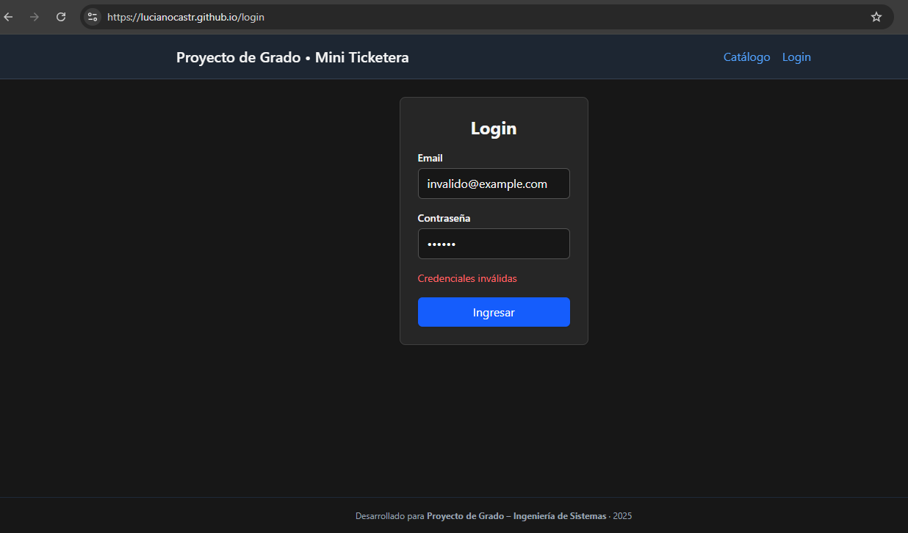
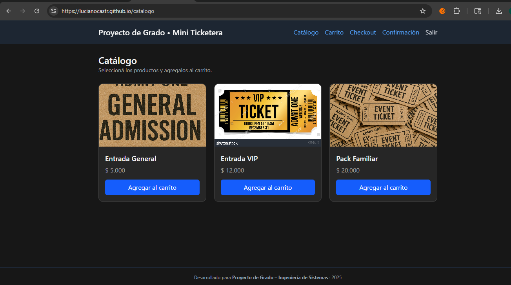
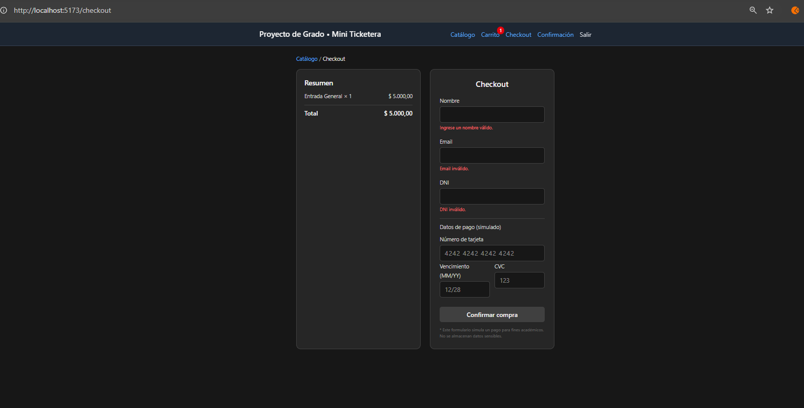
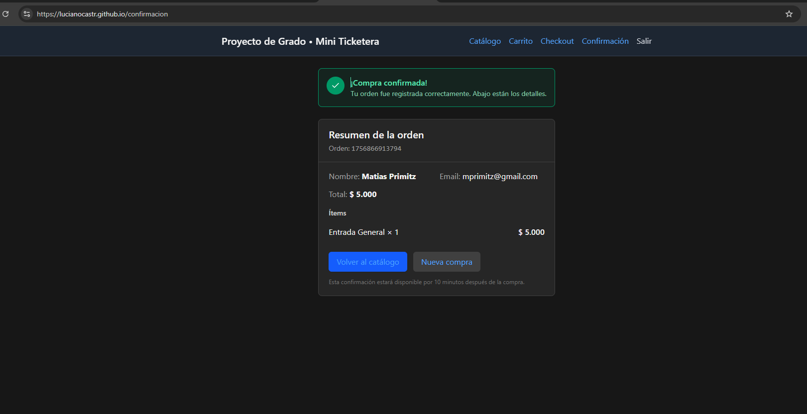
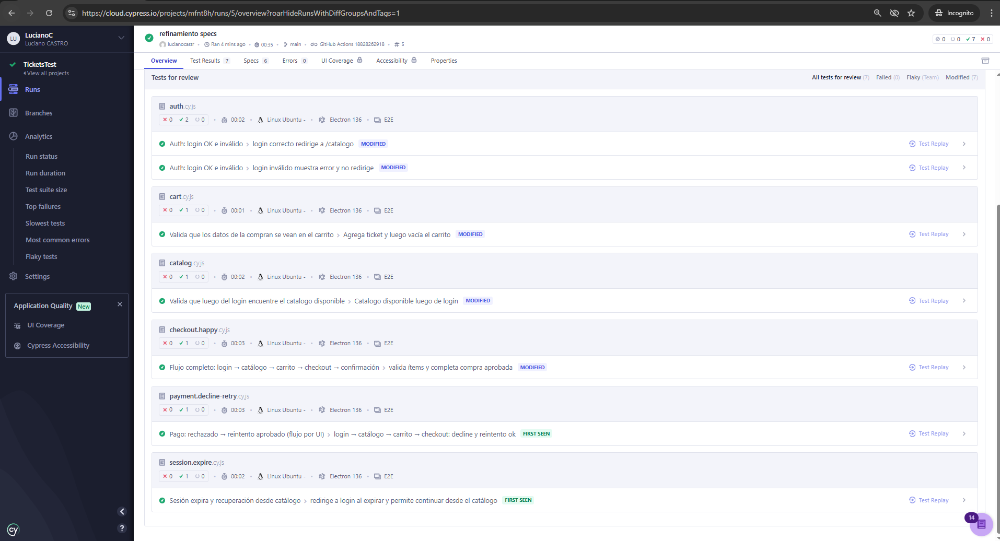

<style>
[class*="i-ph-"] { display:inline-block; vertical-align:-0.125em; }
.slidev-layout {
  background: #0d1117 !important;
  color: #e6edf3;
}
.slidev-layout h1 { color: #10b981 !important; font-size: 1.6em !important; }
.slidev-layout h2 { color: #10b981 !important; }
.slidev-layout h3 { color: #58a6ff !important; }
.slidev-layout p  { margin: 0.4em 0; }
.slidev-layout ul { padding-left: 1.2em; }
.slidev-layout li { margin: 0.25em 0; }

.accent  { color: #10b981; font-weight: 700; }
.blue    { color: #58a6ff; font-weight: 600; }
.muted   { color: #8b949e; }
.red     { color: #f85149; font-weight: 600; }
.small   { font-size: 0.82em; }

.card {
  background: rgba(255,255,255,0.04);
  backdrop-filter: blur(20px);
  border: 1px solid rgba(255,255,255,0.08);
  border-radius: 18px;
  padding: 14px 18px;
}
.card-green {
  background: rgba(16,185,129,0.06);
  backdrop-filter: blur(20px);
  border: 1px solid rgba(16,185,129,0.18);
  border-radius: 18px;
  padding: 14px 18px;
}
.card-blue {
  background: rgba(88,166,255,0.06);
  backdrop-filter: blur(20px);
  border: 1px solid rgba(88,166,255,0.18);
  border-radius: 18px;
  padding: 14px 18px;
}
.card-red {
  background: rgba(248,81,73,0.06);
  backdrop-filter: blur(20px);
  border: 1px solid rgba(248,81,73,0.18);
  border-radius: 18px;
  padding: 14px 18px;
}

.metric-val   { font-size: 2.2em; font-weight: 800; color: #10b981; line-height: 1.1; }
.metric-label { font-size: 0.75em; color: #8b949e; margin-top: 3px; }

.badge       { display:inline-block; background:rgba(16,185,129,0.15); color:#10b981; font-size:0.68em; font-weight:700; padding:3px 10px; border-radius:20px; letter-spacing:.4px; }
.badge-blue  { display:inline-block; background:rgba(88,166,255,0.15); color:#58a6ff; font-size:0.68em; font-weight:700; padding:3px 10px; border-radius:20px; }
.badge-red   { display:inline-block; background:rgba(248,81,73,0.15); color:#f85149; font-size:0.68em; font-weight:700; padding:3px 10px; border-radius:20px; }
.badge-gray  { display:inline-block; background:rgba(255,255,255,0.08); color:#8b949e; font-size:0.68em; font-weight:600; padding:3px 10px; border-radius:20px; }

table { width:100%; border-collapse:collapse; font-size:0.83em; }
th { background:rgba(16,185,129,0.06); color:#10b981; padding:7px 11px; border:1px solid rgba(255,255,255,0.08); text-align:left; }
td { padding:7px 11px; border:1px solid rgba(255,255,255,0.06); color:#e6edf3; }
tr:nth-child(even) td { background:#0d1117; }

.demo-step {
  background:rgba(16,185,129,0.06);
  backdrop-filter:blur(20px);
  border-left:3px solid rgba(16,185,129,0.4);
  padding:8px 14px;
  margin:5px 0;
  border-radius:0 14px 14px 0;
  font-size:0.85em;
}
.step-n { color:#10b981; font-weight:700; margin-right:6px; }

.url-box {
  background:rgba(255,255,255,0.04);
  backdrop-filter:blur(20px);
  border:1px solid rgba(255,255,255,0.08);
  border-radius:14px;
  padding:8px 14px;
  font-family:'Fira Code', monospace;
  font-size:0.78em;
  color:#58a6ff;
}

.a-nd {
  display:flex; flex-direction:column; align-items:center; justify-content:center;
  background:rgba(255,255,255,0.04); backdrop-filter:blur(20px); border:1px solid rgba(255,255,255,0.08); border-radius:14px;
  padding:7px 12px; text-align:center; flex-shrink:0; min-width:88px;
  transition: all 0.32s ease;
}
.a-ic { font-size:1.35em; margin-bottom:2px; }
.a-lb { color:#e6edf3; font-weight:700; font-size:0.70em; line-height:1.2; }
.a-sb { color:#8b949e; font-size:0.62em; line-height:1.3; margin-top:1px; }
.a-nd.a-on { border-color:rgba(16,185,129,0.4) !important; background:rgba(16,185,129,0.1) !important; box-shadow:0 0 24px rgba(16,185,129,0.2); transform:scale(1.10); z-index:5; }
.a-nd.a-off { opacity:0.12; transform:scale(0.95); }
.a-ar { color:#30363d; font-size:1.05em; flex-shrink:0; transition:color 0.32s; line-height:1; }
.a-ar.a-on { color:#10b981; }
.a-ar.a-off { opacity:0.08; }
.a-zn { border-radius:18px; padding:10px 14px; border:1px solid; backdrop-filter:blur(20px); }
.a-zc { background:rgba(16,185,129,0.04); border-color:rgba(16,185,129,0.12); }
.a-zl { background:rgba(88,166,255,0.04); border-color:rgba(88,166,255,0.12); }
.a-zn-lb { font-size:0.60em; font-weight:700; letter-spacing:2px; margin-bottom:8px; }
.a-row { display:flex; align-items:center; gap:7px; }
.a-cap { text-align:center; font-size:0.75em; font-weight:600; min-height:20px; margin-top:6px; }

.bar-wrap { margin:7px 0; }
.bar-label-row { display:flex; justify-content:space-between; margin-bottom:3px; }
.bar-label { font-size:0.74em; color:#8b949e; }
.bar-delta { font-size:0.74em; font-weight:800; color:#10b981; }
.bar-track { height:20px; background:rgba(255,255,255,0.03); border-radius:10px; overflow:hidden; margin-bottom:3px; }
.bar-fill { height:100%; border-radius:10px; display:flex; align-items:center; padding:0 8px; font-size:0.70em; font-weight:700; white-space:nowrap; animation: bar-grow 0.7s cubic-bezier(0.4,0,0.2,1) both; }
.bar-manual { background:rgba(248,81,73,0.12); border:1px solid rgba(248,81,73,0.2); color:#f85149; }
.bar-auto   { background:rgba(16,185,129,0.12); border:1px solid rgba(16,185,129,0.2); color:#10b981; }
@keyframes bar-grow { from { clip-path: inset(0 100% 0 0); } to { clip-path: inset(0 0% 0 0); } }

@keyframes enter-up {
  from { opacity:0; transform:translateY(18px); }
  to   { opacity:1; transform:translateY(0); }
}
@keyframes enter-scale {
  from { opacity:0; transform:scale(0.92); }
  to   { opacity:1; transform:scale(1); }
}
@keyframes metric-pop {
  0%   { opacity:0; transform:scale(0.5); }
  70%  { transform:scale(1.08); }
  100% { opacity:1; transform:scale(1); }
}
@keyframes fade-in {
  from { opacity:0; }
  to   { opacity:1; }
}

.slidev-vclick-target {
  transition: all 0.5s cubic-bezier(0.22, 1, 0.36, 1);
}
.slidev-vclick-hidden {
  opacity: 0 !important;
  transform: translateY(14px);
}
</style>

---
layout: cover
background: linear-gradient(160deg, #0d1117 0%, #071912 60%, #0d1117 100%)
---

<div style="position:absolute; inset:0; display:flex; flex-direction:column; align-items:center; justify-content:space-between; padding:2.5em 3em;">

  <!-- TOP: logo + institución -->
  <div style="display:flex; flex-direction:column; align-items:center; gap:10px; animation: enter-down 0.8s ease both;">
    
    <div style="text-align:center; line-height:1.3;">
      <div style="font-weight:700; font-size:0.85em; color:#e2e8f0;">Centro Regional Universitario Córdoba</div>
      <div class="muted small" style="letter-spacing:1.5px; margin-top:3px;">TRABAJO DE GRADO · INGENIERÍA EN SISTEMAS</div>
    </div>
  </div>

  <!-- CENTER: título -->
  <div style="text-align:center; animation: fade-in 0.8s ease 0.3s both;">
    <h1 style="font-size:1.3em !important; line-height:1.6; color:#10b981 !important; font-weight:700; margin:0;">
      Estrategia de Automatización de Pruebas Funcionales y de Regresión<br>
      para la Mejora de la Calidad del Software en Entornos Cloud
    </h1>
  </div>

  <!-- BOTTOM: autores + tutora -->
  <div style="display:grid; grid-template-columns:1fr 1fr; gap:14px; width:100%; max-width:500px; animation: enter-up 0.8s ease 0.6s both;">
    <div class="card" style="text-align:center;">
      <div class="muted small" style="letter-spacing:1px; margin-bottom:6px;">ESTUDIANTES</div>
      <div style="font-weight:600;">Luciano Castro</div>
      <div style="font-weight:600;">Matías Primitz</div>
    </div>
    <div class="card" style="text-align:center;">
      <div class="muted small" style="letter-spacing:1px; margin-bottom:6px;">TUTORA</div>
      <div style="font-weight:600;">Lic. Natalia Mira</div>
      <div class="muted small" style="margin-top:5px;">2026</div>
    </div>
  </div>

</div>

---

# Agenda

<div style="display:grid; grid-template-columns:1fr 1fr; gap:12px; margin-top:20px;">

<div v-click class="card-green" style="display:flex; gap:12px; align-items:flex-start;">
  <div class="i-ph-magnifying-glass-light" style="width:1.5em; height:1.5em; flex-shrink:0; color:#10b981;" />
  <div>
    <div class="accent small" style="font-weight:700; letter-spacing:.5px;">01 · PROBLEMÁTICA</div>
    <div class="muted small">Contexto, evidencia, impacto y motivación del problema en sistemas transaccionales</div>
  </div>
</div>

<div v-click class="card-green" style="display:flex; gap:12px; align-items:flex-start;">
  <div class="i-ph-crosshair-light" style="width:1.5em; height:1.5em; flex-shrink:0; color:#10b981;" />
  <div>
    <div class="accent small" style="font-weight:700; letter-spacing:.5px;">02 · PROPUESTA</div>
    <div class="muted small">Hipótesis, objetivos, marco conceptual, sistema bajo prueba, casos de prueba y arquitectura</div>
  </div>
</div>

<div v-click class="card-green" style="display:flex; gap:12px; align-items:flex-start;">
  <div class="i-ph-lightning-light" style="width:1.5em; height:1.5em; flex-shrink:0; color:#10b981;" />
  <div>
    <div class="accent small" style="font-weight:700; letter-spacing:.5px;">03 · DEMO EN VIVO</div>
    <div class="muted small">Recorrido en vivo por la arquitectura: pipeline CI/CD y Cypress ejecutando ante el tribunal</div>
  </div>
</div>

<div v-click class="card-green" style="display:flex; gap:12px; align-items:flex-start;">
  <div class="i-ph-chart-bar-light" style="width:1.5em; height:1.5em; flex-shrink:0; color:#10b981;" />
  <div>
    <div class="accent small" style="font-weight:700; letter-spacing:.5px;">04 · RESULTADOS</div>
    <div class="muted small">Métricas comparativas manual vs. automatizado — validación ISO/IEC 25010</div>
  </div>
</div>

<div v-click class="card-green" style="grid-column:span 2; display:flex; gap:12px; align-items:center; justify-content:center;">
  <div class="i-ph-check-circle-light" style="width:1.5em; height:1.5em; color:#10b981;" />
  <div class="accent small" style="font-weight:700; letter-spacing:.5px;">05 · CONCLUSIONES Y PREGUNTAS</div>
</div>

</div>

---

# La Problemática

<div class="muted" style="font-size:0.62em; letter-spacing:2px; font-weight:600; margin-top:14px;">EVIDENCIA DE LA INDUSTRIA</div>

<div style="display:grid; grid-template-columns:repeat(3, 1fr); gap:12px; margin-top:8px;">

<div v-click class="card-red" style="display:flex; flex-direction:column; align-items:center; text-align:center; min-height:130px; justify-content:space-between; transition:all 0.4s ease;" :style="$clicks===1 ? 'box-shadow:0 0 20px rgba(248,81,73,0.4); border-color:rgba(248,81,73,0.6);' : ''">
  <div style="display:flex; align-items:center; gap:6px; margin-bottom:4px;">
    <span class="i-ph-buildings-light" style="width:1.1em; height:1.1em; color:#f85149;" />
    <span class="badge-red">industria</span>
  </div>
  <div style="font-size:1.8em; font-weight:800; color:#f85149; line-height:1.1;">60%</div>
  <div class="muted" style="font-size:0.72em; margin-top:4px;">de las organizaciones sin automatización para entrega continua</div>
  <div style="font-size:0.56em; color:#f8514980; margin-top:3px;">World Quality Report 2023-24</div>
</div>

<div v-click class="card-red" style="display:flex; flex-direction:column; align-items:center; text-align:center; min-height:130px; justify-content:space-between; transition:all 0.4s ease;" :style="$clicks===2 ? 'box-shadow:0 0 20px rgba(248,81,73,0.4); border-color:rgba(248,81,73,0.6);' : ''">
  <div style="display:flex; align-items:center; gap:6px; margin-bottom:4px;">
    <span class="i-ph-currency-dollar-light" style="width:1.1em; height:1.1em; color:#f85149;" />
    <span class="badge-red">costo</span>
  </div>
  <div style="font-size:1.8em; font-weight:800; color:#f85149; line-height:1.1;">6× más</div>
  <div class="muted" style="font-size:0.72em; margin-top:4px;">cuesta un defecto en producción vs. en desarrollo</div>
  <div style="font-size:0.56em; color:#f8514980; margin-top:3px;">PractiTest · State of Testing 2023</div>
</div>

<div v-click class="card-red" style="display:flex; flex-direction:column; align-items:center; text-align:center; min-height:130px; justify-content:space-between; transition:all 0.4s ease;" :style="$clicks===3 ? 'box-shadow:0 0 20px rgba(248,81,73,0.4); border-color:rgba(248,81,73,0.6);' : ''">
  <div style="display:flex; align-items:center; gap:6px; margin-bottom:4px;">
    <span class="i-ph-link-simple-light" style="width:1.1em; height:1.1em; color:#f85149;" />
    <span class="badge-red">adopción</span>
  </div>
  <div style="font-size:1.8em; font-weight:800; color:#f85149; line-height:1.1;">26%</div>
  <div class="muted" style="font-size:0.72em; margin-top:4px;">de equipos con automatización integrada en CI/CD</div>
  <div style="font-size:0.56em; color:#f8514980; margin-top:3px;">ISTQB 2023</div>
</div>

</div>

<div v-click class="muted" style="font-size:0.62em; letter-spacing:2px; font-weight:600; margin-top:14px;">MEDICIÓN PROPIA — BASELINE</div>

<div style="display:grid; grid-template-columns:repeat(3, 1fr); gap:12px; margin-top:8px;">

<div v-click class="card-red" style="display:flex; flex-direction:column; align-items:center; text-align:center; min-height:130px; justify-content:space-between; transition:all 0.4s ease;" :style="$clicks===5 ? 'box-shadow:0 0 20px rgba(248,81,73,0.4); border-color:rgba(248,81,73,0.6);' : ''">
  <div style="display:flex; align-items:center; gap:6px; margin-bottom:4px;">
    <span class="i-ph-magnifying-glass-light" style="width:1.1em; height:1.1em; color:#f85149;" />
    <span class="badge-red">cobertura</span>
  </div>
  <div style="font-size:1.8em; font-weight:800; color:#f85149; line-height:1.1;">43%</div>
  <div class="muted" style="font-size:0.72em; margin-top:4px;">cobertura promedio con testing manual</div>
</div>

<div v-click class="card-red" style="display:flex; flex-direction:column; align-items:center; text-align:center; min-height:130px; justify-content:space-between; transition:all 0.4s ease;" :style="$clicks===6 ? 'box-shadow:0 0 20px rgba(248,81,73,0.4); border-color:rgba(248,81,73,0.6);' : ''">
  <div style="display:flex; align-items:center; gap:6px; margin-bottom:4px;">
    <span class="i-ph-bug-light" style="width:1.1em; height:1.1em; color:#f85149;" />
    <span class="badge-red">defectos</span>
  </div>
  <div style="font-size:1.8em; font-weight:800; color:#f85149; line-height:1.1;">20%</div>
  <div class="muted" style="font-size:0.72em; margin-top:4px;">defectos detectados antes de producción</div>
</div>

<div v-click class="card-red" style="display:flex; flex-direction:column; align-items:center; text-align:center; min-height:130px; justify-content:space-between; transition:all 0.4s ease;" :style="$clicks===7 ? 'box-shadow:0 0 20px rgba(248,81,73,0.4); border-color:rgba(248,81,73,0.6);' : ''">
  <div style="display:flex; align-items:center; gap:6px; margin-bottom:4px;">
    <span class="i-ph-arrows-clockwise-light" style="width:1.1em; height:1.1em; color:#f85149;" />
    <span class="badge-red">reproducibilidad</span>
  </div>
  <div style="font-size:1.8em; font-weight:800; color:#f85149; line-height:1.1;">&lt;50%</div>
  <div class="muted" style="font-size:0.72em; margin-top:4px;">reproducibilidad de ejecuciones manuales</div>
</div>

</div>

---

# ¿Por qué importa?

<div style="display:grid; grid-template-columns:1fr 1fr; gap:12px; margin-top:16px;">

<div v-click class="card-red" style="display:flex; gap:12px; align-items:flex-start; transition:all 0.4s ease;" :style="$clicks===1 ? 'box-shadow:0 0 20px rgba(248,81,73,0.4); border-color:rgba(248,81,73,0.6);' : ''">
  <div class="i-ph-warning-light" style="width:1.5em; height:1.5em; flex-shrink:0; color:#f85149;" />
  <div>
    <div class="red small" style="font-weight:700; margin-bottom:4px;">Impacto Técnico</div>
    <div class="muted small">Bugs en producción, regresiones funcionales e inestabilidad del sistema</div>
  </div>
</div>

<div v-click class="card-red" style="display:flex; gap:12px; align-items:flex-start; transition:all 0.4s ease;" :style="$clicks===2 ? 'box-shadow:0 0 20px rgba(248,81,73,0.4); border-color:rgba(248,81,73,0.6);' : ''">
  <div class="i-ph-coins-light" style="width:1.5em; height:1.5em; flex-shrink:0; color:#f85149;" />
  <div>
    <div class="red small" style="font-weight:700; margin-bottom:4px;">Impacto Comercial</div>
    <div class="muted small">Pérdida de ventas, abandono de carritos y baja tasa de conversión</div>
  </div>
</div>

<div v-click class="card-red" style="display:flex; gap:12px; align-items:flex-start; transition:all 0.4s ease;" :style="$clicks===3 ? 'box-shadow:0 0 20px rgba(248,81,73,0.4); border-color:rgba(248,81,73,0.6);' : ''">
  <div class="i-ph-trend-down-light" style="width:1.5em; height:1.5em; flex-shrink:0; color:#f85149;" />
  <div>
    <div class="red small" style="font-weight:700; margin-bottom:4px;">Impacto Reputacional</div>
    <div class="muted small">Pérdida de confianza del usuario, daño de marca y crisis públicas</div>
  </div>
</div>

<div v-click class="card-red" style="display:flex; gap:12px; align-items:flex-start; transition:all 0.4s ease;" :style="$clicks===4 ? 'box-shadow:0 0 20px rgba(248,81,73,0.4); border-color:rgba(248,81,73,0.6);' : ''">
  <div class="i-ph-hourglass-medium-light" style="width:1.5em; height:1.5em; flex-shrink:0; color:#f85149;" />
  <div>
    <div class="red small" style="font-weight:700; margin-bottom:4px;">Impacto Operativo</div>
    <div class="muted small">Entregas lentas, sobrecarga de QA manual y dificultad de escalado</div>
  </div>
</div>

</div>

<div v-click class="card" style="margin-top:12px; border-left:3px solid #f85149; border-radius:0 8px 8px 0;">
  <p class="small" style="margin:0;"><span class="red">La pregunta central:</span> ¿Puede una estrategia sistemática de automatización resolver estas cuatro dimensiones del problema de forma medible y sostenible?</p>
</div>

---
layout: center
background: linear-gradient(160deg, #0d1117 0%, #071912 100%)
---

<div style="text-align:center; max-width:720px; margin:0 auto;">

<div class="muted small" style="letter-spacing:2px; margin-bottom:16px; animation: fade-in 0.6s ease both;">HIPÓTESIS DE TRABAJO</div>

<p style="font-size:1.25em; line-height:1.7; color:#e6edf3; animation: enter-up 0.8s ease 0.3s both;">
  La integración sistemática de pruebas funcionales y de regresión automatizadas
  dentro de un pipeline CI/CD en entornos cloud
  <span class="accent">mejora de forma medible, reproducible y sostenible</span>
  la calidad del software transaccional.
</p>

<div style="display:grid; grid-template-columns:repeat(3,1fr); gap:14px; margin-top:28px;">
  <div v-click class="card-green" style="text-align:center;">
    <div class="i-ph-ruler-light" style="width:1.6em; height:1.6em; color:#10b981;" />
    <div class="accent small" style="font-weight:700; margin-top:4px;">Medible</div>
    <div class="muted small">métricas de tiempo,<br>cobertura y defectos</div>
  </div>
  <div v-click class="card-green" style="text-align:center;">
    <div class="i-ph-repeat-light" style="width:1.6em; height:1.6em; color:#10b981;" />
    <div class="accent small" style="font-weight:700; margin-top:4px;">Reproducible</div>
    <div class="muted small">mismos resultados en<br>cada ejecución</div>
  </div>
  <div v-click class="card-green" style="text-align:center;">
    <div class="i-ph-recycle-light" style="width:1.6em; height:1.6em; color:#10b981;" />
    <div class="accent small" style="font-weight:700; margin-top:4px;">Sostenible</div>
    <div class="muted small">versionado junto al código,<br>sin esfuerzo adicional</div>
  </div>
</div>

<div v-click style="margin-top:28px; display:flex; align-items:center; justify-content:center; gap:12px; padding:14px 28px; border:2px solid #10b981; border-radius:12px; background:rgba(16,185,129,0.08); animation:fade-in 0.5s ease both;">
  <div class="i-ph-seal-check-light" style="width:1.8em; height:1.8em; color:#10b981; flex-shrink:0;" />
  <span style="font-size:1.05em; font-weight:700; color:#10b981; letter-spacing:1px;">HIPÓTESIS CONFIRMADA</span>
  <span class="muted small" style="margin-left:4px;">— resultados en slides /14 y /15</span>
</div>

</div>

---
transition: slide-left
---

# Objetivo General

<div v-click class="card-blue" style="margin: 12px 0; padding:16px 20px;">
  <p style="font-size:0.92em; line-height:1.6; margin:0;">
    Diseñar, aplicar y validar una estrategia integral de pruebas funcionales y de regresión automatizadas,
    ejecutadas en entornos cloud, que integre las fases de
    <span class="blue">construcción, despliegue, ejecución, reporting y gestión de calidad</span>
    dentro de un flujo continuo, conforme a <span class="blue">ISO/IEC 25010:2023</span>.
  </p>
</div>

<div style="display:grid; grid-template-columns:repeat(3,1fr); gap:9px; margin-top:14px;">

<div v-click class="card small">
  <span class="accent" style="font-weight:700;">OE1</span> &nbsp;Documentar impacto técnico y operativo de la ausencia de automatización
</div>
<div v-click class="card small">
  <span class="accent" style="font-weight:700;">OE2</span> &nbsp;Identificar atributos de calidad afectados según ISO/IEC 25010:2023
</div>
<div v-click class="card small">
  <span class="accent" style="font-weight:700;">OE3</span> &nbsp;Diseñar estrategia de pruebas por cobertura, criticidad y riesgo
</div>
<div v-click class="card small">
  <span class="accent" style="font-weight:700;">OE4</span> &nbsp;Implementar solución funcional con Cypress + GitHub Actions
</div>
<div v-click class="card small">
  <span class="accent" style="font-weight:700;">OE5</span> &nbsp;Validar efectividad mediante métricas y simulaciones de regresión
</div>
<div v-click class="card small">
  <span class="accent" style="font-weight:700;">OE6</span> &nbsp;Documentar estrategia replicable a otros entornos equivalentes
</div>

</div>

---
transition: slide-left
---

# Marco Conceptual

<div v-click class="card-blue small" style="margin-top:10px; display:flex; gap:12px; align-items:flex-start;">
  <span class="i-ph-compass-tool-light" style="width:1.4em; height:1.4em; flex-shrink:0; color:#58a6ff; margin-top:2px;" />
  <div>
    <div class="blue" style="font-weight:700; margin-bottom:4px;">ISO/IEC 25010:2023 — Modelo de Calidad del Producto Software</div>
    <div class="muted small">Estándar internacional que define las características medibles de calidad de un sistema software. Marco de referencia elegido por su aplicabilidad directa a sistemas web transaccionales y su vigencia normativa.</div>
  </div>
</div>

<div style="display:grid; grid-template-columns:repeat(3,1fr); gap:8px; margin-top:10px;">

<div v-click class="card small" style="transition:all 0.4s ease;" :style="$clicks===2 ? 'box-shadow:0 0 16px rgba(88,166,255,0.3); border-color:rgba(88,166,255,0.5);' : ''">
  <div class="blue small" style="font-weight:700; margin-bottom:3px;">Adecuación Funcional</div>
  <div class="muted small">El software cumple las funciones para las que fue diseñado con exactitud y completitud.</div>
</div>

<div v-click class="card small" style="transition:all 0.4s ease;" :style="$clicks===3 ? 'box-shadow:0 0 16px rgba(88,166,255,0.3); border-color:rgba(88,166,255,0.5);' : ''">
  <div class="blue small" style="font-weight:700; margin-bottom:3px;">Fiabilidad</div>
  <div class="muted small">Capacidad de mantener el nivel de desempeño bajo condiciones definidas durante un período determinado.</div>
</div>

<div v-click class="card small" style="transition:all 0.4s ease;" :style="$clicks===4 ? 'box-shadow:0 0 16px rgba(88,166,255,0.3); border-color:rgba(88,166,255,0.5);' : ''">
  <div class="blue small" style="font-weight:700; margin-bottom:3px;">Eficiencia de Desempeño</div>
  <div class="muted small">Rendimiento relativo a los recursos utilizados en condiciones establecidas.</div>
</div>

<div v-click class="card small" style="transition:all 0.4s ease;" :style="$clicks===5 ? 'box-shadow:0 0 16px rgba(88,166,255,0.3); border-color:rgba(88,166,255,0.5);' : ''">
  <div class="blue small" style="font-weight:700; margin-bottom:3px;">Mantenibilidad</div>
  <div class="muted small">Facilidad con la que el sistema puede ser modificado, actualizado y corregido.</div>
</div>

<div v-click class="card small" style="transition:all 0.4s ease;" :style="$clicks===6 ? 'box-shadow:0 0 16px rgba(88,166,255,0.3); border-color:rgba(88,166,255,0.5);' : ''">
  <div class="blue small" style="font-weight:700; margin-bottom:3px;">Seguridad</div>
  <div class="muted small">Protección de información y datos contra accesos no autorizados o manipulación indebida.</div>
</div>

<div v-click class="card small" style="transition:all 0.4s ease;" :style="$clicks===7 ? 'box-shadow:0 0 16px rgba(88,166,255,0.3); border-color:rgba(88,166,255,0.5);' : ''">
  <div class="blue small" style="font-weight:700; margin-bottom:3px;">Flexibilidad</div>
  <div class="muted small">Capacidad de adaptarse a diferentes entornos, configuraciones o requisitos cambiantes.</div>
</div>

</div>

---
transition: slide-left
---

# El Sistema Bajo Prueba

<div class="muted small" style="margin-bottom:14px;">
  <span class="badge-gray">Mini Ticketera</span>&nbsp;
  Plataforma web de venta de entradas desarrollada en React + Vite — desplegada en GitHub Pages
</div>

<div style="display:grid; grid-template-columns:1fr 1fr 1fr 1fr; gap:8px;">

<div v-click style="text-align:center;">
  <div class="muted small" style="margin-bottom:4px; letter-spacing:.5px;">LOGIN</div>
  
  <div class="muted" style="font-size:0.65em; margin-top:4px;">TC-001 · Autenticación</div>
</div>

<div v-click style="text-align:center;">
  <div class="muted small" style="margin-bottom:4px; letter-spacing:.5px;">CATÁLOGO</div>
  
  <div class="muted" style="font-size:0.65em; margin-top:4px;">TC-005 · Disponibilidad</div>
</div>

<div v-click style="text-align:center;">
  <div class="muted small" style="margin-bottom:4px; letter-spacing:.5px;">CHECKOUT</div>
  
  <div class="muted" style="font-size:0.65em; margin-top:4px;">TC-002/003 · Compra & Pago</div>
</div>

<div v-click style="text-align:center;">
  <div class="muted small" style="margin-bottom:4px; letter-spacing:.5px;">CONFIRMACIÓN</div>
  
  <div class="muted" style="font-size:0.65em; margin-top:4px;">TC-002 · Happy path</div>
</div>

</div>

<div v-click style="margin-top:14px; display:flex; gap:10px; align-items:stretch;">
  <div class="url-box" style="flex:1; display:flex; align-items:center;"><span class="i-ph-globe-light" style="width:1em; height:1em; flex-shrink:0; color:#58a6ff;" />&nbsp; https://lucianocastr.github.io/ticketeraTesis/</div>
  <div class="url-box" style="flex:1; display:flex; align-items:center;"><span class="i-ph-package-light" style="width:1em; height:1em; flex-shrink:0; color:#58a6ff;" />&nbsp; github.com/lucianocastr/ticketeraTesis</div>
</div>

---
transition: slide-left
---

# Alcance y Limitaciones

<div style="display:grid; grid-template-columns:1fr 1fr; gap:12px; margin-top:16px;">

<div>
<div class="card-blue small" style="margin-bottom:10px;">
  <div class="blue" style="font-weight:700; margin-bottom:6px;"><span class="i-ph-check-light" style="width:1em; height:1em; color:#58a6ff;" /> Dentro del alcance</div>
  <ul style="margin:0; padding-left:1.1em;">
    <li>Pruebas funcionales E2E sobre flujos transaccionales críticos</li>
    <li>Pipeline CI/CD completo en entorno cloud (GitHub)</li>
    <li>Comparación cuantitativa manual vs. automatizado</li>
    <li>Alineación con ISO/IEC 25010:2023</li>
    <li>Estrategia documentada y replicable</li>
  </ul>
</div>
</div>

<div>
<div class="card-red small" style="margin-bottom:10px;">
  <div class="red" style="font-weight:700; margin-bottom:6px;"><span class="i-ph-x-light" style="width:1em; height:1em; color:#f85149;" /> Fuera del alcance</div>
  <ul style="margin:0; padding-left:1.1em;">
    <li>Pruebas unitarias y de integración</li>
    <li>Pruebas de performance y carga</li>
    <li>Sistema legacy o de terceros</li>
    <li>Validación con muestra estadísticamente significativa</li>
    <li>Ambiente cloud empresarial (AWS / Azure / GCP)</li>
  </ul>
</div>
</div>

</div>

<div v-click class="card" style="margin-top:10px; border-left:3px solid #58a6ff; border-radius:0 8px 8px 0;">
  <p class="small" style="margin:0;">El sistema bajo prueba fue desarrollado por los autores con testeabilidad como requisito de diseño. Los resultados son válidos como <span class="blue">prueba de concepto</span> y base para la replicación en entornos reales.</p>
</div>

---
transition: slide-left
---

# Los 6 Casos de Prueba

<div style="display:grid; grid-template-columns:1fr 1.1fr; gap:16px; margin-top:12px; align-items:start;">

<div>
  
  <div class="muted" style="font-size:0.7em; text-align:center; margin-top:5px;">
    Cypress Cloud — todos los specs en una ejecución real
  </div>
</div>

<div>
  <table>
    <thead><tr><th>ID</th><th>Flujo crítico</th></tr></thead>
    <tbody>
      <tr><td><span class="badge">TC-001</span></td><td>Login correcto e inválido</td></tr>
      <tr><td><span class="badge">TC-002</span></td><td>Compra completa (happy path E2E)</td></tr>
      <tr><td><span class="badge">TC-003</span></td><td>Pago rechazado + reintento exitoso</td></tr>
      <tr><td><span class="badge">TC-004</span></td><td>Carrito: agregar, totales, vaciar</td></tr>
      <tr><td><span class="badge">TC-005</span></td><td>Catálogo disponible post-login</td></tr>
      <tr><td><span class="badge">TC-006</span></td><td>Sesión expirada y recuperación</td></tr>
    </tbody>
  </table>

</div>

</div>

<!-- SLIDE HIDDEN temporalmente: Implementación — Buenas Prácticas Aplicadas -->

---
transition: slide-left
---

# Pipeline CI/CD

<div style="display:flex; gap:10px; margin-bottom:12px; align-items:center;">
  <div class="card-green small" style="flex:1; text-align:center; padding:8px 10px; transition:all 0.3s;"
    :style="$clicks===0 ? 'border-color:#10b981;box-shadow:0 0 10px #10b981aa;' : 'opacity:0.35;'">
    <span class="accent" style="font-weight:700;">STEP 1</span> · Build
  </div>
  <div style="font-size:1.3em; transition:color 0.3s;"
    :style="$clicks===0 ? 'color:#10b981;' : 'color:#30363d;'">→</div>
  <div class="card-green small" style="flex:1; text-align:center; padding:8px 10px; transition:all 0.3s;"
    :style="$clicks===1 ? 'border-color:#10b981;box-shadow:0 0 10px #10b981aa;' : 'opacity:0.35;'">
    <span class="accent" style="font-weight:700;">STEP 2</span> · Deploy · Staging
  </div>
  <div style="font-size:1.3em; transition:color 0.3s;"
    :style="$clicks===1 ? 'color:#10b981;' : 'color:#30363d;'">→</div>
  <div class="card-green small" style="flex:1; text-align:center; padding:8px 10px; transition:all 0.3s;"
    :style="$clicks===2 ? 'border-color:#10b981;box-shadow:0 0 10px #10b981aa;' : 'opacity:0.35;'">
    <span class="accent" style="font-weight:700;">STEP 3</span> · E2E Tests
  </div>
</div>

```yaml {1-10|12-15|17-21}
name: CI/CD — Deploy & E2E Tests
on:
  push:       { branches: [main] }

jobs:
  build:
    steps:
      - uses: actions/checkout@v4
      - run: npm ci && npm run build
      - uses: actions/upload-pages-artifact@v3

  deploy:
    needs: build
    steps:
      - uses: actions/deploy-pages@v4

  e2e:
    needs: deploy
    steps:
      - run: npx cypress run --browser chrome --record
      - uses: actions/upload-artifact@v4
```

---
clicks: 5
transition: slide-left
---

<h1 v-if="$clicks===0">Arquitectura de la Solución</h1>
<h1 v-if="$clicks>=1" style="color:#10b981; font-size:1.4em;"><span class="i-ph-lightning-light" style="width:1em; height:1em;" /> Arquitectura de la Solución — Demo en tiempo real</h1>

<div style="margin-top:10px;"><div class="a-zn a-zc" style="margin-bottom:7px;"><div class="a-zn-lb" style="color:#10b981;"><span class="i-ph-cloud-light" style="width:1em; height:1em; color:#10b981;" /> CLOUD</div><div class="a-row" style="margin-bottom:9px;"><div class="a-nd" :class="$clicks===2?'a-on':$clicks>0?'a-off':''"><div class="a-ic"><span class="i-ph-github-logo-light" style="width:1.35em; height:1.35em;" /></div><div class="a-lb">GitHub</div><div class="a-sb">Repositorio</div></div><div class="a-ar" :class="($clicks===2||$clicks===3)?'a-on':$clicks>0?'a-off':''">→</div><div class="a-nd" :class="$clicks===3?'a-on':$clicks>0?'a-off':''"><div class="a-ic"></div><div class="a-lb">GitHub Actions</div><div class="a-sb">Pipeline YAML</div></div><div class="a-ar" :class="($clicks===3||$clicks===4)?'a-on':$clicks>0?'a-off':''">→</div><div class="a-nd" :class="$clicks===4?'a-on':$clicks>0?'a-off':''"><div class="a-ic"><span class="i-ph-atom-light" style="width:1.35em; height:1.35em;" /></div><div class="a-lb">Build + Deploy</div><div class="a-sb">React + Vite · GitHub Pages</div></div><div style="flex:1;"></div></div><div class="a-row" style="padding-left:116px;"><div class="a-ar" style="transform:rotate(90deg);" :class="($clicks===3||$clicks===5)?'a-on':$clicks>0?'a-off':''">→</div><div class="a-nd" :class="$clicks===5?'a-on':$clicks>0?'a-off':''"><div class="a-ic"></div><div class="a-lb">Cypress E2E</div><div class="a-sb">6 specs · headless</div></div><div class="a-ar" :class="$clicks===5?'a-on':$clicks>0?'a-off':''">→</div><div class="a-nd" :class="$clicks===5?'a-on':$clicks>0?'a-off':''"><div class="a-ic" style="display:flex;gap:2px;justify-content:center;align-items:center;"><span class="i-ph-cloud-light" style="width:1.1em; height:1.1em;" /></div><div class="a-lb">Cypress Cloud</div><div class="a-sb">resultados + evidencias</div></div><div class="a-ar" :class="$clicks===5?'a-on':$clicks>0?'a-off':''">→</div><div class="a-nd" :class="$clicks===5?'a-on':$clicks>0?'a-off':''"><div class="a-ic" style="display:flex;gap:2px;justify-content:center;align-items:center;"><span class="i-ph-github-logo-light" style="width:1.1em; height:1.1em;" /><span class="i-ph-kanban-light" style="width:1.1em; height:1.1em;" /></div><div class="a-lb">GitHub Projects</div><div class="a-sb">issues auto-gestionados</div></div></div></div><div class="a-zn a-zl"><div class="a-zn-lb" style="color:#58a6ff;"><span class="i-ph-desktop-light" style="width:1em; height:1em; color:#58a6ff;" /> LOCAL</div><div class="a-row"><div class="a-nd" :class="$clicks===1?'a-on':$clicks>0?'a-off':''"><div class="a-ic"><span class="i-ph-code-light" style="width:1.35em; height:1.35em;" /></div><div class="a-lb">Equipo Dev</div><div class="a-sb">commit / push</div></div><div class="a-ar" :class="$clicks===1?'a-on':$clicks>0?'a-off':''">+</div><div class="a-nd" :class="$clicks===1?'a-on':$clicks>0?'a-off':''"><div class="a-ic" style="display:flex;gap:2px;justify-content:center;"><span class="i-ph-magnifying-glass-light" style="width:1.1em; height:1.1em;" /><span class="i-ph-bug-beetle-light" style="width:1.1em; height:1.1em;" /></div><div class="a-lb">Equipo QA</div><div class="a-sb">specs · commit / push</div></div><div class="a-ar" :class="($clicks===1||$clicks===2)?'a-on':$clicks>0?'a-off':''"><span class="i-ph-arrow-up-light" style="width:0.9em; height:0.9em;" /> push</div><div style="flex:1;"></div><div class="a-nd" :class="$clicks===5?'a-on':$clicks>0?'a-off':''"><div class="a-ic"><span class="i-ph-user-circle-light" style="width:1.35em; height:1.35em;" /></div><div class="a-lb">Product Owner</div><div class="a-sb">Approve / Reject</div></div></div></div><div class="a-cap"><span v-if="$clicks===1" style="color:#10b981;">① Dev escribe código · QA escribe specs de Cypress · ambos hacen commit y push</span><span v-if="$clicks===2" style="color:#10b981;">② GitHub recibe el push y dispara automáticamente el trigger CI/CD</span><span v-if="$clicks===3" style="color:#10b981;">③ GitHub Actions lee el YAML y orquesta todos los pasos del pipeline</span><span v-if="$clicks===4" style="color:#10b981;">④ Build de la app React + Vite y deploy automático en GitHub Pages</span><span v-if="$clicks===5" style="color:#10b981;">⑤ Cypress ejecuta los 6 specs · Cypress Cloud registra resultados · GitHub Projects gestiona los issues automáticamente</span></div></div>

---

# Metodología de Medición

<div style="display:grid; grid-template-columns:1fr 1fr; gap:12px; margin-top:14px;">

<div class="card-blue small">
  <div class="blue" style="font-weight:700; margin-bottom:8px;">Diseño experimental</div>
  <ul style="margin:0; padding-left:1.1em;">
    <li><strong>n = 5 iteraciones</strong> por escenario controlado</li>
    <li>Variables independientes: tipo de testing (manual / automatizado)</li>
    <li>Variables dependientes: tiempo, cobertura, detección, reproducibilidad</li>
    <li>Mismos flujos ejecutados en ambas modalidades</li>
  </ul>
</div>

<div class="card small">
  <div class="accent" style="font-weight:700; margin-bottom:8px;">Protocolo de medición</div>
  <ul style="margin:0; padding-left:1.1em;">
    <li>Manual: ejecución cronometrada por los autores con guía de pasos fija</li>
    <li>Automatizado: ejecución headless en GitHub Actions runner Ubuntu</li>
    <li>Resultados registrados en Cypress Cloud y GitHub Actions logs</li>
    <li>Herramienta de reporte: Mochawesome (HTML + JSON)</li>
  </ul>
</div>

</div>

<div v-click class="card" style="margin-top:10px; border-left:3px solid #10b981; border-radius:0 8px 8px 0;">
  <p class="small" style="margin:0;"><span class="muted">Alcance del estudio:</span> Estudio exploratorio de viabilidad. Los resultados demuestran consistencia dentro de las 5 iteraciones y son base para investigación futura con muestras de mayor tamaño.</p>
</div>

---

# Resultados

<div style="max-width:720px; margin:12px auto 0 auto;">

  <div v-click class="bar-wrap">
    <div class="bar-label-row"><span class="bar-label">Tiempo por ciclo</span><span class="bar-delta">−87%</span></div>
    <div class="bar-track"><div class="bar-fill bar-manual" style="width:100%;">15 min</div></div>
    <div class="bar-track"><div class="bar-fill bar-auto"   style="width:13%;">2 min</div></div>
  </div>

  <div v-click class="bar-wrap">
    <div class="bar-label-row"><span class="bar-label">Cobertura de casos críticos</span><span class="bar-delta">+57 pp</span></div>
    <div class="bar-track"><div class="bar-fill bar-manual" style="width:43%;">43%</div></div>
    <div class="bar-track"><div class="bar-fill bar-auto"   style="width:100%;">100%</div></div>
  </div>

  <div v-click class="bar-wrap">
    <div class="bar-label-row"><span class="bar-label">Detección pre-deploy</span><span class="bar-delta">+80 pp</span></div>
    <div class="bar-track"><div class="bar-fill bar-manual" style="width:20%;">20%</div></div>
    <div class="bar-track"><div class="bar-fill bar-auto"   style="width:100%;">100%</div></div>
  </div>

  <div v-click class="bar-wrap">
    <div class="bar-label-row"><span class="bar-label">Esfuerzo humano total (n=5)</span><span class="bar-delta">−80%</span></div>
    <div class="bar-track"><div class="bar-fill bar-manual" style="width:100%;">75 min</div></div>
    <div class="bar-track"><div class="bar-fill bar-auto"   style="width:20%;">15 min</div></div>
  </div>

  <div v-click class="bar-wrap">
    <div class="bar-label-row"><span class="bar-label">Reproducibilidad</span><span class="bar-delta">+50 pp</span></div>
    <div class="bar-track"><div class="bar-fill bar-manual" style="width:50%;">&lt;50%</div></div>
    <div class="bar-track"><div class="bar-fill bar-auto"   style="width:100%;">100%</div></div>
  </div>

  <div style="display:flex; gap:14px; margin-top:12px; align-items:center; justify-content:center;">
    <div style="display:flex; align-items:center; gap:5px;">
      <div style="width:14px; height:14px; background:#2a0e0e; border:1px solid #f8514950; border-radius:3px;"></div>
      <span class="muted small">Testing manual</span>
    </div>
    <div style="display:flex; align-items:center; gap:5px;">
      <div style="width:14px; height:14px; background:#071912; border:1px solid #10b98150; border-radius:3px;"></div>
      <span class="muted small">Automatizado</span>
    </div>
    <span class="badge" style="margin-left:16px;">n = 5 iteraciones</span>
  </div>

</div>

---

# Validación ISO/IEC 25010:2023

<div style="display:grid; grid-template-columns:1fr 1fr 1fr; gap:10px; margin-top:18px;">

<div v-click class="card-green">
  <div class="accent small" style="font-weight:700; margin-bottom:5px;"><span class="i-ph-check-light" style="width:0.9em; height:0.9em; color:#10b981;" /> Adecuación Funcional</div>
  <div class="muted small">100% flujos críticos validados: login, compra, checkout, carrito, sesión.</div>
</div>

<div v-click class="card-green">
  <div class="accent small" style="font-weight:700; margin-bottom:5px;"><span class="i-ph-check-light" style="width:0.9em; height:0.9em; color:#10b981;" /> Fiabilidad</div>
  <div class="muted small">Ejecución reproducible en cloud sin variaciones ni falsos positivos.</div>
</div>

<div v-click class="card-green">
  <div class="accent small" style="font-weight:700; margin-bottom:5px;"><span class="i-ph-check-light" style="width:0.9em; height:0.9em; color:#10b981;" /> Eficiencia de Desempeño</div>
  <div class="muted small">Reducción del 87% en tiempo y 80% en esfuerzo operativo por ciclo.</div>
</div>

<div v-click class="card-green">
  <div class="accent small" style="font-weight:700; margin-bottom:5px;"><span class="i-ph-check-light" style="width:0.9em; height:0.9em; color:#10b981;" /> Mantenibilidad</div>
  <div class="muted small">Specs versionadas con el código; actualizadas automáticamente en el pipeline.</div>
</div>

<div v-click class="card-green">
  <div class="accent small" style="font-weight:700; margin-bottom:5px;"><span class="i-ph-check-light" style="width:0.9em; height:0.9em; color:#10b981;" /> Seguridad</div>
  <div class="muted small">TC-006 valida sesiones expiradas y bloqueos de acceso no autorizado.</div>
</div>

<div v-click class="card-green">
  <div class="accent small" style="font-weight:700; margin-bottom:5px;"><span class="i-ph-check-light" style="width:0.9em; height:0.9em; color:#10b981;" /> Flexibilidad</div>
  <div class="muted small">Estrategia documentada y replicable a cualquier sistema web transaccional.</div>
</div>

</div>

<div v-click class="card-blue small" style="margin-top:14px; text-align:center;">
  Alineado con <span class="blue">ISO/IEC 25010:2023</span> —
  modelo de referencia: <span class="blue">Adecuación Funcional · Fiabilidad · Eficiencia · Mantenibilidad · Seguridad · Flexibilidad</span>
</div>

---

# Conclusiones

<div style="margin-top:12px; display:flex; flex-direction:column; gap:10px;">

<div v-click class="card" style="border-left:3px solid #10b981; border-radius:0 8px 8px 0; display:flex; gap:14px; align-items:flex-start;">
  <div class="i-ph-check-circle-light" style="width:1.4em; height:1.4em; flex-shrink:0; color:#10b981;" />
  <p class="small" style="margin:0;"><span class="accent">La hipótesis fue confirmada.</span> La automatización integrada en CI/CD mejora la calidad del software de forma medible, reproducible y sostenible. Los datos lo prueban: −87% en tiempo, 100% en cobertura y detección.</p>
</div>

<div v-click class="card" style="border-left:3px solid #10b981; border-radius:0 8px 8px 0; display:flex; gap:14px; align-items:flex-start;">
  <div class="i-ph-lock-key-open-light" style="width:1.4em; height:1.4em; flex-shrink:0; color:#10b981;" />
  <p class="small" style="margin:0;"><span class="accent">Herramientas open-source son suficientes.</span> Cypress + GitHub Actions + GitHub Pages permiten implementar prácticas de ingeniería de calidad profesional con costo cero.</p>
</div>

<div v-click class="card" style="border-left:3px solid #10b981; border-radius:0 8px 8px 0; display:flex; gap:14px; align-items:flex-start;">
  <div class="i-ph-infinity-light" style="width:1.4em; height:1.4em; flex-shrink:0; color:#10b981;" />
  <p class="small" style="margin:0;"><span class="accent">El modelo es replicable.</span> Aplicable a cualquier sistema web con flujos transaccionales críticos: e-commerce, fintech, SaaS, retail.</p>
</div>

<div v-click class="card" style="border-left:3px solid #10b981; border-radius:0 8px 8px 0; display:flex; gap:14px; align-items:flex-start;">
  <div class="i-ph-trend-down-light" style="width:1.4em; height:1.4em; flex-shrink:0; color:#10b981;" />
  <p class="small" style="margin:0;"><span class="accent">El testing manual no escala.</span> Lento, de baja cobertura, no trazable. La automatización resolvió las tres debilidades identificadas en el diagnóstico inicial.</p>
</div>

</div>

---

# Contribuciones del Trabajo

<div style="display:grid; grid-template-columns:1fr 1fr 1fr; gap:8px; margin-top:10px;">

<div v-click class="card-blue" style="display:flex; flex-direction:column; gap:5px; transition:all 0.4s ease;" :style="$clicks===1 ? 'box-shadow:0 0 20px rgba(88,166,255,0.35); border-color:rgba(88,166,255,0.5);' : ''">
  <div style="text-align:center;"><span class="i-ph-graduation-cap-light" style="width:1.4em; height:1.4em; color:#58a6ff;" /></div>
  <div class="blue small" style="font-weight:700; text-align:center; letter-spacing:.5px;">A NIVEL ACADÉMICO</div>
  <ul class="muted small" style="margin:0; padding-left:1.1em;">
    <li>Evidencia concreta de cómo ISO/IEC 25010 se operacionaliza mediante automatización</li>
    <li>Puente documentado entre norma teórica e implementación real</li>
    <li>Caso de estudio replicable para cátedras o investigaciones futuras</li>
  </ul>
  <div class="card" style="margin-top:auto; font-size:0.72em; color:#58a6ff; border-color:#58a6ff40;">
    De norma abstracta a métricas reales y reproducibles
  </div>
</div>

<div v-click class="card-green" style="display:flex; flex-direction:column; gap:5px; transition:all 0.4s ease;" :style="$clicks===2 ? 'box-shadow:0 0 20px rgba(16,185,129,0.35); border-color:rgba(16,185,129,0.5);' : ''">
  <div style="text-align:center;"><span class="i-ph-gear-six-light" style="width:1.4em; height:1.4em; color:#10b981;" /></div>
  <div class="accent small" style="font-weight:700; text-align:center; letter-spacing:.5px;">A NIVEL TÉCNICO</div>
  <ul class="muted small" style="margin:0; padding-left:1.1em;">
    <li>Pipeline CI/CD orientado a <strong>calidad</strong>, no solo a despliegue</li>
    <li>Automatización de apertura/cierre de issues según resultado de tests</li>
    <li>Evidencia objetiva y auditable: manual vs. automatizado</li>
    <li>Stack open-source con nivel de ingeniería profesional</li>
  </ul>
  <div class="card" style="margin-top:auto; font-size:0.72em; color:#10b981; border-color:#10b98140;">
    Herramientas open-source, prácticas de ingeniería profesional
  </div>
</div>

<div v-click class="card" style="display:flex; flex-direction:column; gap:5px; border-color:#f0883e; transition:all 0.4s ease;" :style="$clicks===3 ? 'box-shadow:0 0 20px rgba(240,136,62,0.35); border-color:rgba(240,136,62,0.6);' : 'border-color:#f0883e40;'">
  <div style="text-align:center;"><span class="i-ph-briefcase-light" style="width:1.4em; height:1.4em; color:#f0883e;" /></div>
  <div style="color:#f0883e; font-weight:700; font-size:0.82em; text-align:center; letter-spacing:.5px;">A NIVEL PROFESIONAL</div>
  <ul class="muted small" style="margin:0; padding-left:1.1em;">
    <li>Modelo replicable a cualquier sistema transaccional</li>
    <li>Adoptable por equipos con distinto nivel de madurez técnica</li>
    <li>DevOps + QA = reducción de tiempos, riesgos y costos</li>
  </ul>
  <div class="card" style="margin-top:auto; font-size:0.72em; color:#f0883e; border-color:#f0883e40;">
    Modelo documentado y paquete de replicación listo para adoptar
  </div>
</div>

</div>

---

# Líneas Futuras de Mejora

<div style="display:grid; grid-template-columns:1fr 1fr; gap:12px; margin-top:18px;">

<div v-click class="card" style="display:flex; gap:12px;">
  <div class="i-ph-test-tube-light" style="width:1.4em; height:1.4em; flex-shrink:0; color:#58a6ff;" />
  <div>
    <div class="blue small" style="font-weight:700; margin-bottom:4px;">Pruebas no funcionales</div>
    <div class="muted small">Performance, carga y seguridad automatizados (k6, Lighthouse CI, OWASP ZAP)</div>
  </div>
</div>

<div v-click class="card" style="display:flex; gap:12px;">
  <div class="i-ph-robot-light" style="width:1.4em; height:1.4em; flex-shrink:0; color:#58a6ff;" />
  <div>
    <div class="blue small" style="font-weight:700; margin-bottom:4px;">IA en QA</div>
    <div class="muted small">Generación dinámica de casos de prueba y predicción de defectos con LLMs</div>
  </div>
</div>

<div v-click class="card" style="display:flex; gap:12px;">
  <div class="i-ph-chart-bar-light" style="width:1.4em; height:1.4em; flex-shrink:0; color:#58a6ff;" />
  <div>
    <div class="blue small" style="font-weight:700; margin-bottom:4px;">Dashboards en tiempo real</div>
    <div class="muted small">Monitoreo continuo con métricas históricas e integración a sistemas de alertas</div>
  </div>
</div>

<div v-click class="card" style="display:flex; gap:12px;">
  <div class="i-ph-shield-light" style="width:1.4em; height:1.4em; flex-shrink:0; color:#58a6ff;" />
  <div>
    <div class="blue small" style="font-weight:700; margin-bottom:4px;">Análisis estático integrado</div>
    <div class="muted small">SonarQube y CodeQL como gates de calidad dentro del mismo pipeline</div>
  </div>
</div>

</div>

---
layout: center
background: linear-gradient(160deg, #0d1117 0%, #071912 100%)
---

<div style="text-align:center;">

<div style="margin-bottom:10px; animation: enter-scale 0.8s ease both;"><span class="i-ph-graduation-cap-light" style="width:3em; height:3em; color:#10b981;" /></div>
<h1 style="color:#10b981 !important; font-size:2em !important; margin-bottom:6px; animation: enter-up 0.7s ease 0.3s both;">¡Muchas Gracias!</h1>
<p class="muted" style="margin-bottom:26px; animation: fade-in 0.8s ease 0.5s both;">
  Luciano Castro · Matías Primitz &nbsp;·&nbsp;
  <span class="small">Tutora: Lic. Natalia Mira</span>
</p>

<div style="display:grid; grid-template-columns:1fr 1fr; gap:12px; max-width:560px; margin:0 auto 20px auto; animation: enter-up 0.8s ease 0.7s both;">
  <div class="url-box" style="text-align:left;">
    <span class="i-ph-package-light" style="width:1em; height:1em; color:#58a6ff;" /> github.com/<span style="color:#10b981;">lucianocastr</span>/ticketeraTesis
  </div>
  <div class="url-box" style="text-align:left;">
    <span class="i-ph-globe-light" style="width:1em; height:1em; color:#58a6ff;" /> lucianocastr.github.io/<span style="color:#10b981;">ticketeraTesis</span>/
  </div>
  <div class="url-box" style="text-align:left; grid-column:span 2;">
    <span class="i-ph-chart-bar-light" style="width:1em; height:1em; color:#58a6ff;" /> cloud.cypress.io/projects/<span style="color:#10b981;">mfnt8h</span>/runs
  </div>
</div>

<div style="display:grid; grid-template-columns:repeat(4,1fr); gap:10px; max-width:460px; margin:0 auto;">
  <div class="card small" style="text-align:center;">
    <div style="height:1.8em; display:flex; justify-content:center; align-items:center;"></div>
    <div class="muted">Cypress</div>
  </div>
  <div class="card small" style="text-align:center;">
    <div style="height:1.8em; display:flex; justify-content:center; align-items:center;"></div>
    <div class="muted">GitHub Actions</div>
  </div>
  <div class="card small" style="text-align:center;">
    <div style="height:1.8em; display:flex; justify-content:center; align-items:center; gap:3px;">
      
      
    </div>
    <div class="muted">React + Vite</div>
  </div>
  <div class="card small" style="text-align:center;">
    <div style="height:1.8em; display:flex; justify-content:center; align-items:center;"><span class="i-ph-seal-check-light" style="width:1.4em; height:1.4em; color:#8b949e;" /></div>
    <div class="muted">ISO/IEC 25010</div>
  </div>
</div>

<p class="muted" style="font-size:0.72em; margin-top:22px;">
  Centro Regional Universitario Córdoba · Ingeniería en Sistemas · 2026
</p>

</div>
